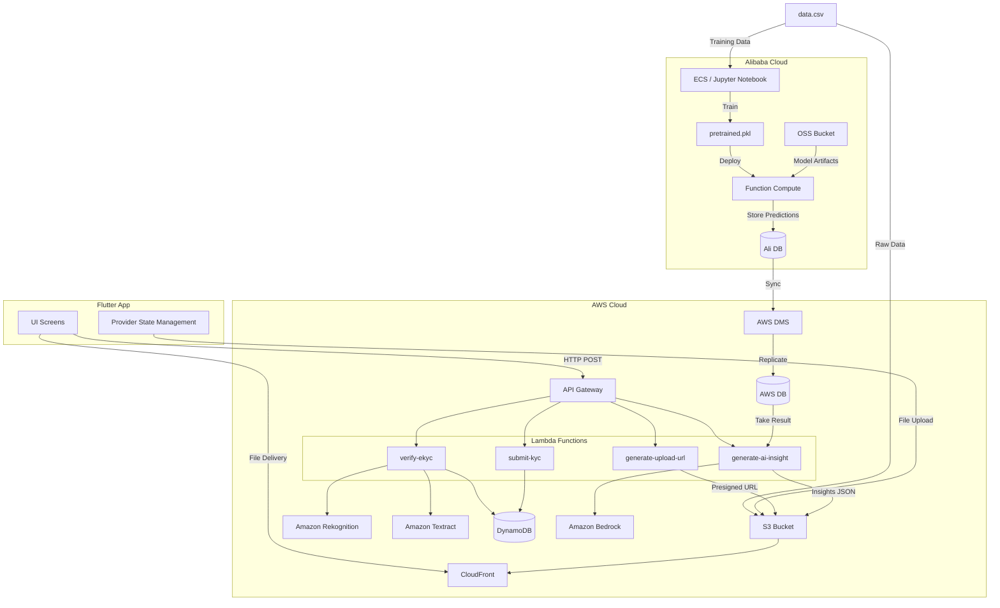
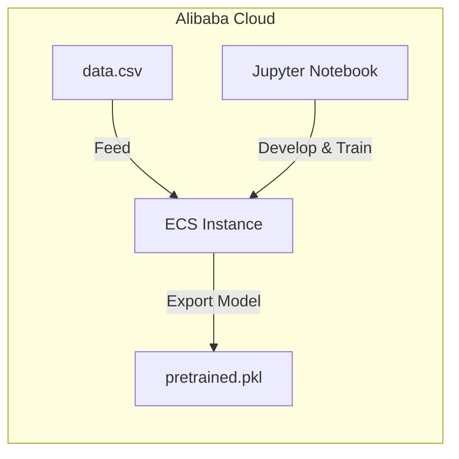

# eWallet App

A Flutter-based e-wallet application with AI-driven credit insights, digital microloans (Spark Loan), and AI-powered eKYC identity verification. Built with a **hybrid Alibaba Cloud + AWS serverless backend** — leveraging Alibaba Cloud for ML model training and inference, and AWS for eKYC, AI credit analysis, and content delivery.

## Features

| Feature | Description |
|---------|-------------|
| **Home Dashboard** | Account balance, recent transactions, quick services, and credit score widget |
| **Credit Score** | Real-time AI-generated credit analysis with personalized improvement recommendations powered by Amazon Bedrock |
| **Spark Loan** | Entrepreneur-focused microloan product (RM 500 – RM 3,500) with AI-recommended interest rates and repayment periods based on credit score |
| **eKYC Verification** | End-to-end digital identity verification: document upload, face comparison, OCR data extraction, and review submission |
| **Services Hub** | Quick access to Spark Loan, bill payments, top-ups, and more |
| **Loan Management** | Create, track, and repay microloans with real-time status updates |

## Tech Stack

### Frontend
- **Flutter** (cross-platform mobile)
- **Provider** for state management
- **Responsive UI** with custom scaling utilities

### Backend (Alibaba Cloud + AWS Hybrid)

**Alibaba Cloud**
- **Alibaba Cloud ECS** — model training environment with Jupyter Notebook
- **Alibaba Cloud OSS** — object storage for training data and model artifacts
- **Alibaba Cloud Function Compute** — serverless inference for the pre-trained ML model (`pretrained.pkl`)
- **Alibaba Cloud RDS / Ali DB** — stores predicted results from the ML model

**AWS Serverless**
- **Amazon API Gateway** — REST API endpoints
- **AWS Lambda** — serverless compute for business logic and orchestration
- **Amazon S3** — document and selfie image storage
- **Amazon Rekognition** — face comparison for identity verification
- **Amazon Textract** — OCR for extracting ID/passport data
- **Amazon DynamoDB** — user data, KYC records, and loan storage
- **Amazon Bedrock** — AI credit insight generation
- **AWS DMS** — data sync from Ali DB to AWS DB
- **Amazon CloudFront** — CDN for file delivery to the mobile app

## Architecture

### TrustScore Hybrid Cloud Architecture



### Model Pre-training Architecture (Alibaba Cloud)



## Project Structure

```
lib/
├── core/                  # App theme, responsive utilities
├── models/                # Data models (User, Loan, AI Credit Insight, etc.)
├── screens/               # UI screens
│   ├── credit_score/      # Credit score with AI insights
│   ├── home/              # Dashboard
│   ├── microloan/         # Spark Loan (create + manage + repay)
│   ├── kyc/               # eKYC flow (intro, document, selfie, review)
│   ├── services/          # Services grid
│   └── ...
├── services/              # API service classes
├── state/                 # AppState (Provider)
├── widgets/               # Reusable widgets
└── main.dart              # App entry point

```

## Setup Instructions

### Prerequisites
- Flutter SDK (>= 3.0)
- Dart SDK
- Android Studio / Xcode (for emulators)
- An AWS account (for backend features)

### 1. Clone the Repository

```bash
git clone https://github.com/ashuan945/ewallet_app.git
cd ewallet_app
```

### 2. Install Dependencies

```bash
flutter pub get
```

### 3. Configure API Endpoints

Update the following service files with your own AWS API Gateway endpoints if deploying a custom backend:

- `lib/services/credit_insight_service.dart` — AI credit insight endpoint
- `lib/services/ekyc_verification_service.dart` — eKYC verification endpoint
- `lib/services/aws_upload_service.dart` — S3 presigned URL endpoint

### 4. Run the App

```bash
# For Android
flutter run

# For a specific device
flutter devices
flutter run -d <device-id>
```

### 5. Build Release APK

```bash
flutter build apk --release
```

## Key User Flows

### eKYC Identity Verification
1. User navigates to **Profile → Account Verification**
2. Selects document type (IC or Passport) and uploads images
3. Takes a live selfie for face comparison
4. System auto-extracts name, ID number, DOB, and nationality via OCR
5. User reviews and edits extracted data
6. Submits for verification — status updates to **"Verification in Progress"**

### Credit Score & AI Insights
1. User taps **Credit Score** from the home dashboard
2. App calls AI insight API (Bedrock) with user ID
3. Displays: credit score ring, risk tier, score explanation, future score drivers, and personalized improvement policies
4. Loan offer card shows eligible Spark Loan amount based on score

### Spark Loan (Microloan)
1. User taps **Apply for Spark Loan** from Credit Score or Services
2. App shows AI-recommended amount range, interest rate, and tenure based on credit score
3. User selects business purpose and adjusts amount within range
4. Reviews repayment summary and accepts terms
5. Loan is created with **"Pending"** status for approval

## API Endpoints

| Endpoint | Method | Purpose |
|----------|--------|---------|
| `/generate-upload-url` | POST | Get presigned S3 URL for document upload |
| `/verify-ekyc` | POST | Face comparison + OCR extraction |
| `/submit-kyc` | POST | Persist verified KYC data to DynamoDB |
| `/generate-ai-insight` | POST | Generate AI credit analysis via Bedrock |


## License

This project is for educational and demonstration purposes.
